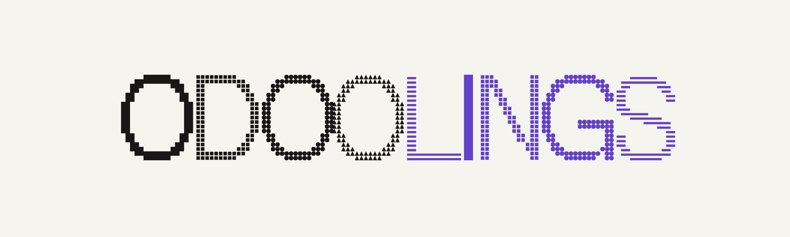

# Odoolings

<p align="center">
  <a href="https://odoolings.ronit.io">
    <picture>
      <source media="(prefers-color-scheme: dark)" srcset="web/public/brand/odoolings-wordmark-on-ink.png">
      <source media="(prefers-color-scheme: light)" srcset="web/public/brand/odoolings-wordmark-on-paper.png">
      
    </picture>
  </a>
</p>

A hands-on Odoo 19 development tutorial: zero Odoo knowledge to OCA-quality
contributions, taught by building one real app, not by reading about one.

### [**📖 Start reading → odoolings.ronit.io**](https://odoolings.ronit.io/)

No signup, no account. Progress and quiz scores live in your browser only.

## What makes this different

- **Your code, checked, not just your memory.** `odoolings`, a
  [rustlings](https://github.com/rust-lang/rustlings)-style CLI, inspects your actually
  running Odoo over XML-RPC after every hands-on section and tells you exactly what's
  missing, with a hint, never the answer.
- **One real app, cover to cover.** Every chapter extends the same capstone,
  **LibreFleet** (a vehicle-workshop management app), so relations, security, and
  business logic all click together instead of forty disconnected snippets.
- **Practice over prose.** Quizzes with real explanations (not syntax trivia), a
  checkpoint to diff against after every chapter, and break-it labs that make you read
  an actual traceback before you fix it.
- **Taught the way integrators actually work.** Docker-first, OCA conventions from
  chapter one, and a track record of finding real bugs in itself: every chapter is
  executed for real before it's written, never recalled from memory.

## Where it's at

24 of ~40 chapters are live, through Part 4 (Business Logic). See the
[roadmap](https://odoolings.ronit.io/docs/roadmap) for the full
milestone breakdown, and
[`ODOO_TUTORIAL_MASTER_PLAN.md`](ODOO_TUTORIAL_MASTER_PLAN.md) for the curriculum and
the reasoning behind every decision, including a running changelog.

## Following the tutorial?

You don't need to clone this repository at all. Chapter 5 has you create your own
workspace from a [template repo](https://github.com/ronitjadhav/odoolings-starter)
(two files, no Odoo experience needed to set up), so your LibreFleet build ends up in
*your own* git history, not a fork of someone else's tutorial. From there, chapter 8
fetches individual reference snapshots on demand, whenever you want to check your work
against the reference implementation.

## Working on this repo

This is the authoring monorepo: the site, every chapter's content, the `odoolings.py`
checker, and the reference snapshots readers diff against.

| Path | Contents |
|---|---|
| `web/` | The site itself: Next.js + Fumadocs, statically exported to GitHub Pages |
| `code/addons/` | Empty on purpose. Readers build LibreFleet in their *own* repo, not here |
| `code/odoolings.py` | The rustlings-style CLI that checks a reader's work chapter by chapter |
| `code/checkpoints/` | A snapshot of LibreFleet after each chapter, the reference to diff against |
| `code/docker-compose.yml` | The Odoo 19 + Postgres 16 dev environment used throughout |
| `ODOO_TUTORIAL_MASTER_PLAN.md` | The full curriculum, every decision, and why it was made |

Two repositories in total:

| Repository | What it is | Changes |
|---|---|---|
| **odoolings** (this one) | Everything above. | every chapter |
| **[odoolings-starter](https://github.com/ronitjadhav/odoolings-starter)** | A GitHub *template*: the Odoo 19 workspace readers press "Use this template" on. Five files. | almost never |

`code/docker-compose.yml` and `code/odoo.conf` here are the **source of truth**; the
starter carries copies, and CI fails the build if the two drift, so change them here
first and mirror the change over.

### Run the dev environment

```bash
cd code && docker compose up
```

Open <http://localhost:8069> and create a database. Master password is `admin`.

### Preview the site locally

```bash
cd web && npm install && npm run dev
```

## License

Prose and images: [CC BY-SA 4.0](LICENSE-content). Code: [AGPL-3.0](LICENSE-code),
matching OCA convention.
